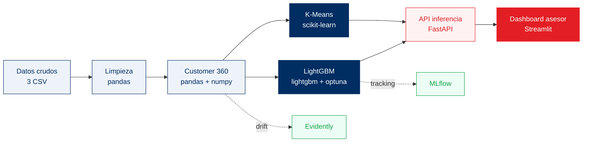
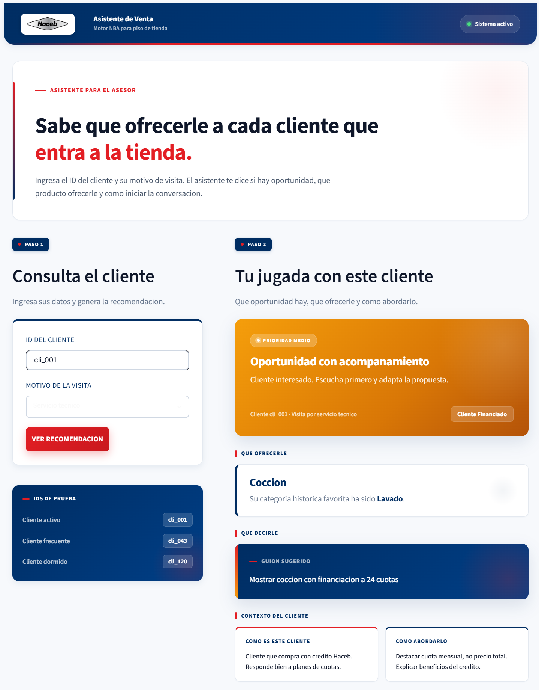
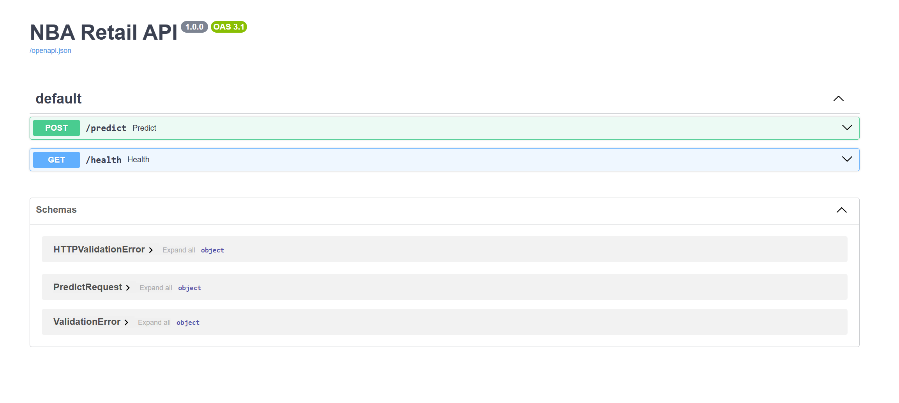
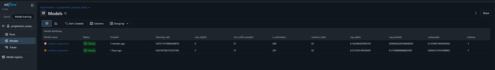

# Motor de Acciones Comerciales Retail - Haceb

Sistema de Next Best Action (NBA) para retail fisico. Convierte cada visita a tienda en una recomendacion accionable para el asesor combinando dos modelos complementarios:

- **K-Means Clustering**: responde el **COMO** atender al cliente. Define el perfil de comportamiento y el tono del asesor (VIP, financiado, servicios, dormido, nuevo potencial).
- **LightGBM Propension**: responde el **QUE** ofrecerle. Estima la probabilidad de compra en la visita y determina la categoria de producto a proponer.

**Slide ejecutivo (entregable 2):** https://mariaguzman1120.github.io/motor-acciones-comerciales-retail-haceb/

## Pipeline y herramientas

Flujo end-to-end de siete etapas, orquestado con Prefect. Cada caja representa un paso del pipeline con su herramienta principal:



### Etapas detalladas

| # | Etapa | Modulo | Herramientas | Entrada | Salida |
| --- | --- | --- | --- | --- | --- |
| 1 | Ingesta | `python/data/preprocessing.py` | pandas, pyarrow | 3 CSV crudos | DataFrames en memoria |
| 2 | Limpieza | `python/data/preprocessing.py` | pandas, regex | Clientes crudos | `clientes_clean.parquet` + flags |
| 3 | Customer 360 | `python/features/build_features.py` | pandas, numpy | Datasets limpios | `customer_360.parquet` (30 features) |
| 4 | Segmentacion | `python/models/train_segmentation.py` | scikit-learn (KMeans, StandardScaler, silhouette) | Customer 360 | `kmeans_segmentation.joblib` (5 segmentos) |
| 5 | Propension | `python/models/train_propensity.py` | lightgbm, optuna (TPE), sklearn (StratifiedKFold), mlflow | Customer 360 + visitas | `lgbm_propension.joblib` (AUC 0.89) |
| 6 | Serving | `python/api/main.py` | FastAPI, Uvicorn, Pydantic | id_cliente + motivo_visita | JSON con segmento, score y accion |
| 7 | UI asesor | `python/front/app.py` | Streamlit, requests | Input del asesor | Recomendacion visual en tienda |

### Servicios transversales

| Capa | Herramienta | Rol |
| --- | --- | --- |
| Orquestacion | **Prefect** | DAG del pipeline con observabilidad, retries y logs correlacionados |
| Tracking | **MLflow** | Registro de experimentos, parametros, metricas y modelos versionados |
| Monitoreo | **Evidently** | Deteccion de data drift con `DataDriftPreset` (KS + chi2) |

Detalle tecnico completo (variables, hiperparametros, contratos, artefactos) en [PIPELINE.md](PIPELINE.md).

## Instalacion

```powershell
python -m venv .venv
.\.venv\Scripts\Activate.ps1
python -m pip install --upgrade pip
python -m pip install -r requirements.txt
```

## Ejecucion del pipeline de entrenamiento

```powershell
python main.py
```

Orquesta con Prefect las 7 etapas: carga, limpieza, Customer 360, seleccion de k, K-Means, preparacion de datos, HPO con Optuna, entrenamiento final LightGBM y reporte de drift. Genera artefactos en `models/`, `data/processed/` y `reports/`.

## Levantar los servicios

Tres procesos en paralelo, uno por servicio:

```powershell
# Terminal 1 - Tracking de experimentos
python -m mlflow ui --backend-store-uri sqlite:///mlflow.db --port 5000

# Terminal 2 - API de inferencia
python -m uvicorn python.api.main:app --reload --port 8000

# Terminal 3 - Dashboard para asesores en tienda
python -m streamlit run python/front/app.py --server.port 8501
```

### Vista de los servicios corriendo

**Dashboard del asesor (Streamlit) — [http://localhost:8501](http://localhost:8501)**

Recomendacion en tiempo real para el asesor en piso de venta con la NBA y el guion sugerido:



**API de inferencia (FastAPI + Swagger UI) — [http://localhost:8000/docs](http://localhost:8000/docs)**

Endpoint `/predict` con contrato JSON auto-documentado por OpenAPI:



**Tracking de experimentos (MLflow UI) — [http://localhost:5000](http://localhost:5000)**

Registro de corridas del modelo de propension con parametros, metricas y artefactos versionados:



## Estructura del repositorio

```text
data/
  raw/                             datos originales (clientes, transacciones, interacciones)
  processed/                       parquets generados por el pipeline

python/
  data/preprocessing.py            carga, limpieza y flags de calidad
  features/build_features.py       Customer 360 (RFM + conductual)
  models/
    train_segmentation.py          K-Means, seleccion de k, persistencia
    train_propensity.py            LightGBM + Optuna + MLflow tracking
    predict.py                     NBAPredictor de inferencia en tiempo real
  api/main.py                      FastAPI /predict y /health
  front/app.py                     Streamlit para el asesor
  monitoring/drift_report.py       reporte de drift con Evidently
  training_flow_prefect.py         orquestacion del pipeline

models/                            artefactos serializados (.joblib)
reports/                           reportes HTML de drift
notebooks/                         analisis exploratorio y validacion
docs/                              slide ejecutivo (index.html) y PDF del enunciado

main.py                            punto de entrada del pipeline
requirements.txt                   dependencias
```

## Endpoints de la API

```text
POST /predict     Recibe { id_cliente, motivo_visita } y devuelve segmento, score, categoria y accion
GET  /health      Verificacion de disponibilidad
```

Ejemplo de respuesta:

```json
{
  "id_cliente": "cli_001",
  "segmento": "VIP Comprador",
  "score_compra_hoy": 0.72,
  "nivel": "ALTO",
  "next_best_category": "lavado",
  "categoria_favorita": "refrigeracion",
  "accion_recomendada": "Ofrecer lavado premium con garantia extendida"
}
```

## Salidas principales

```text
data/processed/customer_360.parquet     tabla unificada por cliente con RFM y conductual
models/kmeans_segmentation.joblib       modelo de segmentacion
models/scaler_segmentation.joblib       StandardScaler asociado al K-Means
models/lgbm_propension.joblib           modelo de propension
models/ordinal_encoder.joblib           encoder de variables categoricas
reports/drift_report_prefect.html       reporte de drift de Evidently
mlflow.db                               tracking de experimentos
```

## Resultados de la corrida productiva

- **AUC-ROC** (LightGBM + Optuna, 5-fold CV): **0.889** (+/- 0.020)
- **Lift decil top**: 1.8x vs. baseline sin modelo
- **Latencia p95** de inferencia: <100 ms
- **Segmentos K-Means**: 5 (Silhouette optimo)
- **Trials Optuna**: 50 (busqueda bayesiana TPE)

## Documentacion adicional

- [PIPELINE.md](PIPELINE.md): descripcion detallada del pipeline, los modelos, las variables y el monitoreo.
- [docs/index.html](docs/index.html): slide ejecutivo one-page (entregable 2).
